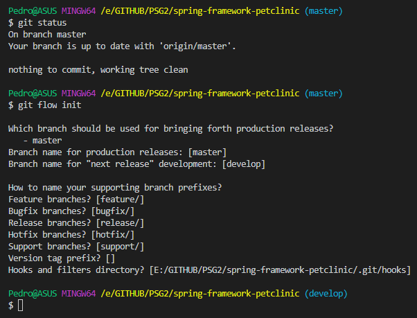
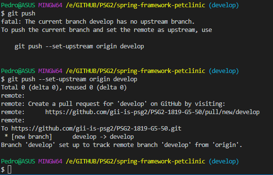

# Universidad de Sevilla
## Escuela Técnica Superior de Ingeniería Informática
&nbsp;
&nbsp;
# L2 - Configuration Management

## Grado en Ingeniería Informática - Ingeniería del Software

## Proceso de Software y Gestión 2
## Curso 2018 - 2019

| Fecha     |    |Revisión |
|-----------|----|----------|
|17/03/2019 |    |v01e00|

Grupo de Prácticas: G5-50

| Autores |     | Rol |
|---------|-----|------|
| González Valiñas, Pedro Agustín |  | Scrum Master |
| Delgado Luna, Ángel             |  | Team member |
| Novoa Montero, Ana María        |  | Team member |
| Pérez Capitán, Sergio           |  | Team member |
| Rosado Bornes, Víctor           |  | Team member |
| Sánchez Hipona, Antonio         |  | Team member |

&nbsp;

| Índice |
|--------|
| [1. Introducción](#1-introduccion) |
| [2. Objetivo](#2-objetivo) |
| [3. Contenido](#3-contenido) |
| [3.1. Estructura del repositorio y estrategia de ramas](#31-estructura-del-repositorio-y-estrategia-de-ramas) |
| [3.2. Política de versionado](#32-política-de-versionado) |

## 1. Introducción
En este documento vamos a recoger la metodología de gestión de la configuración trabajada en L2 - Configuration Management.

## 2. Objetivo
El objetivo del presente documento es describir el sistema de gestión de la configuración de nuestro equipo para los proyectos que vamos a realizar.

## 3. Contenido
Las issues de este entregable pueden consultarse [aquí](https://github.com/gii-is-psg2/PSG2-1819-G5-50/issues).

| Issue | |Descripción |
|-------|----|-----------|
| A2.3.2.a | | Structure of repositories and default branches |
| A2.3.2.b | | Branching strategy, based on Git Flow |
| A2.3.2.c | | Versioning policies |

La gestión de la configuración es clave dentro del desarrollo de un proceso que conlleve la generación de nuevos artefactos, entendiendo por artefacto, entidades que se generan, aportan valor o necesitan consultarse dentro de la organización. 

Por ese motivo, el código implementado, los documentos para los desarrolladores, los manuales de usuario, constituyen ejemplos de artefactos y el gestor de la configuración del equipo debe desarrollar unas directrices que permitan su correcta gestión.

Adicionalmente, recomendamos que se visite la wiki para ver la parte concerniente a la [política de nombrado de artefactos](https://github.com/gii-is-psg2/PSG2-1819-G5-50/wiki/Configuration-Management-System#naming-policy-for-artefacts).

El sistema de gestión de la configuración se ha descrito ampliamente en nuestra [wiki](https://github.com/gii-is-psg2/PSG2-1819-G5-50/wiki/Configuration-Management-System).

## 3.1. Estructura del repositorio y estrategia de ramas

En nuestro caso hemos agrupado las issues A2.3.2.a y A2.3.2.b dentro de una misma entrada, ya que para el Sprint 2 se recomendaba pasar a una estrategia basada en Git Flow. Esta estrategia permite la incorporación de funcionalidades sobre una rama común (**develop**) evitando los commits directos sobre dicha rama. 
Seguimos las recomendaciones de configuración descritas en este [magnífico tutorial](https://danielkummer.github.io/git-flow-cheatsheet/), inicializando el repositorio con la siguiente configuración de ramas:

Tras dicha configuración, es necesario realizar ***push*** para que el resto de componentes del equipo visualicen la rama **develop**.

De esta manera, todas las funcionalidades emanan de **develop** y tras su desarrollo, se realiza un ***merge*** sobre **develop**.

Esta manera de gestionar el código ha sido muy beneficiosa con respecto a la estrategia del Sprint 1, donde todos "íbamos" a **master** y para evitar conflictos era necesario realizar las tareas de manera secuencial.

Git Flow supone una mejora de la independencia temporal para la realización de las tareas y mejora la integración del código. Obviamente, existen y han existido conflictos al hacer ***merge*** de las funcionalidades, pero su resolución resulta sencilla.

La configuración de nuestro repositorio basada en la estrategia de Git Flow resulta en la siguiente imagen tomada de un [magnífico tutorial de Atlassian](https://www.atlassian.com/git/tutorials/comparing-workflows/gitflow-workflow).

.svg?cdnVersion=ld)

Adicionalmente, recomendamos visitar la wiki para ver la [política para los mensajes de commit de git](https://github.com/gii-is-psg2/PSG2-1819-G5-50/wiki/Configuration-Management-System#message-policy-for-git-commits).

## 3.2. Política de versionado

Para la gestión del versionado de ramas, como hemos descrito en nuestra [wiki](https://github.com/gii-is-psg2/PSG2-1819-G5-50/wiki/Configuration-Management-System#labels-for-semantic-versioning), nos hemos basado en las especificaciones de [Tom Preston-Werner](https://github.com/mojombo/).

Consideramos el siguiente algoritmo para asignar una etiqueta a un proyecto:
- Si existe una etiqueta previa, la consideramos como línea base y nuestra nueva etiqueta será el resultado de incrementar según la **convención** sobre la existente.
- Si no existe una etiqueta previa, asignaremos la primera etiqueta conforme a la **convención**.

La convención es la siguiente
Para un número de versión que siga este patrón `MAJOR`.`MINOR`.`PATCH`, se incrementa:

`MAJOR` cuando se hagan cambios incompatibles con la API,

`MINOR` cuando se añade una funcionalidad incompatible con la versión anterior, y

`PATCH` cuando se hacen arreglos que no suponen pérdida ni modificaciones severas de la funcionalidad.

Se pueden agregar etiquetas adicionales para pre-releases y versiones definitivas que extiendan el patrón `MAJOR`.`MINOR`.`PATCH`

Adicionalmente, recomendamos que se visite la wiki para ver la parte concerniente a la [petición de cambios](https://github.com/gii-is-psg2/PSG2-1819-G5-50/wiki/Configuration-Management-System#change-management).

