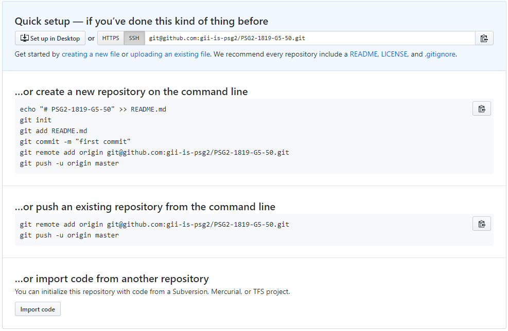
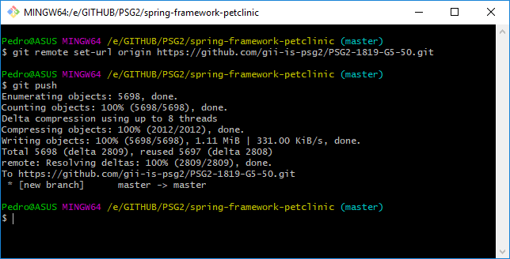
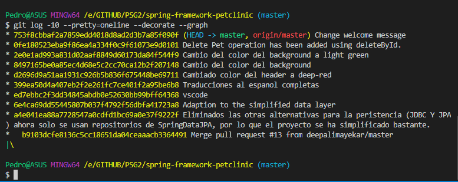
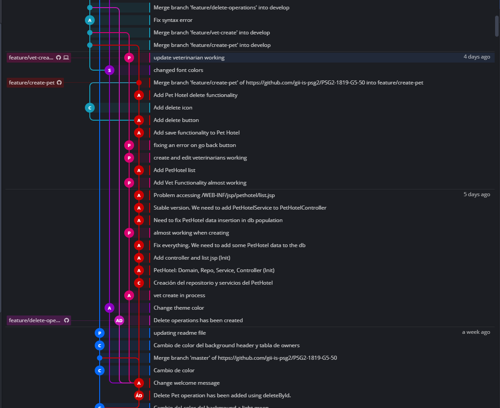
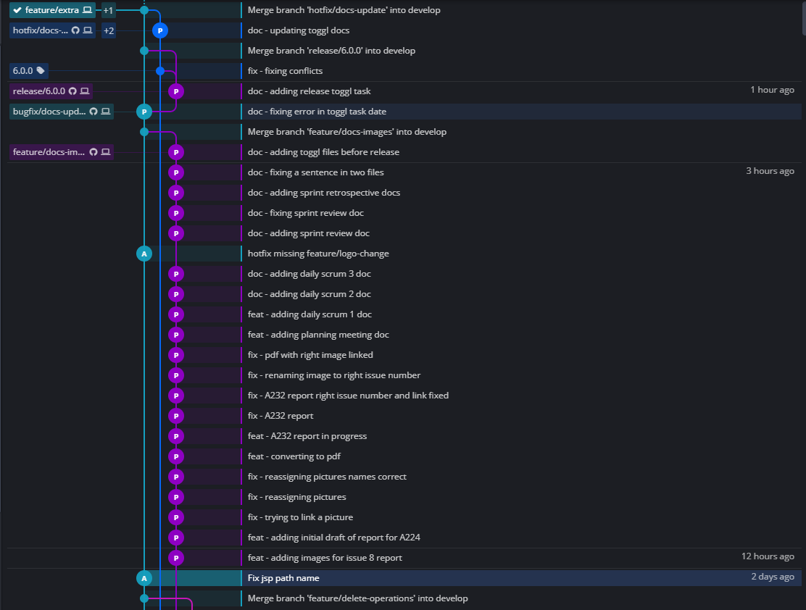

# Universidad de Sevilla
## Escuela Técnica Superior de Ingeniería Informática
&nbsp;
&nbsp;
# L2 - Configuration Management

## Grado en Ingeniería Informática - Ingeniería del Software

## Proceso de Software y Gestión 2
## Curso 2018 - 2019

| Fecha     |    |Revisión |
|-----------|----|----------|
|17/03/2019 |    |v01e00|

Grupo de Prácticas: G5-50

| Autores |     | Rol |
|---------|-----|------|
| González Valiñas, Pedro Agustín |  | Scrum Master |
| Delgado Luna, Ángel             |  | Team member |
| Novoa Montero, Ana María        |  | Team member |
| Pérez Capitán, Sergio           |  | Team member |
| Rosado Bornes, Víctor           |  | Team member |
| Sánchez Hipona, Antonio         |  | Team member |

&nbsp;

| Índice |
|--------|
| [1. Introducción](#1-introduccion) |
| [2. Objetivo](#2-objetivo) |
| [3. Contenido](#3-contenido) |

## 1. Introducción
En este documento vamos a recoger el proceso de desarrollo de las primeras tareas relativas al L2 - Configuration Management.

## 2. Objetivo
El objetivo de esta práctica es aprender a desarrollar la gestión de la configuración dentro de un equipo, utilizando la metodología de Scrum.

## 3. Contenido
Las issues de este entregable pueden consultarse [aquí](https://github.com/gii-is-psg2/PSG2-1819-G5-50/issues).

En una primera parte del Sprint, se adjudicaron y se asignaron las siguientes:

| Issue | |Descripción |
|-------|----|-----------|
| A2.2.2. | |Clone repo and init |
| A2.2.3.a| |Change header color |
| A2.2.3.b| |Change background color |
| A2.2.3.c| |Change welcomePage message |
| A2.2.3.d| |Owner DELETE his pets |
| A2.2.3.e| |Translate messages to spanish |
| A2.2.3.f| |Change background color when looking for Owners |

Se repartieron de manera equitativa y según el grado de dificultad, teniendo en cuenta la necesidad de conocimientos sobre Spring para su realización.

En la siguiente captura vemos el resultado que aparece en github.com tras la inicialización del repositorio.

Para redirigir el repositorio local, hacia el repositorio remoto, se ejecutaron los comandos que se muestran en la siguiente captura.

En la siguiente captura, de manera muy gráfica vemos el resultado de la finalización de tareas obtenido mediante comandos.

A modo de resumen, comprobamos que el reparto de tareas sin archivos en común y realizadas de manera secuencial sobre la rama principal ***master***, ha propiciado la inexistencia de conflictos, ya que todos los miembros del equipo hacíamos **pull** y no tocábamos archivos en común.

Para el resto de issues, que constituyen la segunda parte del sprint, proseguimos con la metodología de trabajo basada en Git Flow y descrita en nuestra [wiki](https://github.com/gii-is-psg2/PSG2-1819-G5-50/wiki/Configuration-Management-System#structure-of-repositories-and-default-branches).

| Issue | |Descripción |
|-------|----|-----------|
| A2.3.3.a| |Create PetHotel |
| A2.3.3.b| | Reassign logos, fonts & colors of the pages |
| A2.3.3.c| | Veterinarian CREATE and EDIT functionality |
| A2.3.3.d| | Owner, Pet, Veterinarian DELETE |
| A2.3.4  | | Prepare a release of the Petclinic project |

Como estas tareas requerían conocimientos del framework Spring, exceptuando la tarea A2.3.3.d, el resto se repartió por parejas, para que los compañeros que no cursan Diseño y Pruebas este año, implementaran conjuntamente con los que sí la cursan, las funcionalidades requeridas.

En la siguiente captura de GitKraken, se muestra el historial de commits para conseguir las 4 funcionalidades requeridas de la tarea A.2.3.3:

Tras la finalización de estas funcionalidades, se abrió una nueva feature para incluir toda la documentación del proyecto en las carpetas `docs` e `images` y se procedió a realizar la release con el etiquetado `6.0.0` debido a la existencia de una etiqueta anterior. Hemos asumido que los cambios introducidos, tanto a nivel de persistencia en la base de datos, como a nivel de código, suponen un gran cambio en la aplicación. 
Por lo tanto, al aplicar la convención de la que se habló en el report de la tarea A2.3.2 y que puede encontrarse en la [wiki](https://github.com/gii-is-psg2/PSG2-1819-G5-50/wiki/Configuration-Management-System#labels-for-semantic-versioning), resultó ser la etiqueta más apropiada.

En la siguiente captura de GitKraken, se muestra el historial de commits relativos a la generación de la documentación y a la creación de la release. Hay que indicar que hubo que realizar un hotfix al advertir que había dos tareas sin asociar a nuestro workspace de toggl.

La estrategia de Git Flow de trabajar por funcionalidades permite que haya diferentes desarrolladores realizando implementaciones por su cuenta, sin interferir en el trabajo de los otros. Lógicamente, hay archivos que han sido implementados por todos los miembros de manera simultánea y a la hora de hacer un ***merge*** han dado un conflicto, sin embargo, la resolución es sencilla. 

## Comparativa de Git Flow vs "todos a master"

Los pros de Git Flow:
- Permite un trabajo simultáneo para incrementar funcionalidades sin estorbarse los unos a los otros.
- Favorece el desarrollo de funcionalidades sencillas.
- Las funcionalidades más complicadas, se integrarán más adelante.

Los contras de Git Flow:
- Requiere la agrupación de código por funcionalidades, lo cual a veces puede suponer un esfuerzo de agrupación y las tareas pueden ser extensas.
- Requiere capacidad de abstracción para separar el código por funcionalidades lo más discretas posible.
- Requiere un punto de inicio o línea base común para iniciar funcionalidades y un punto destino al que convergen todas las funcionalidades del sprint.

