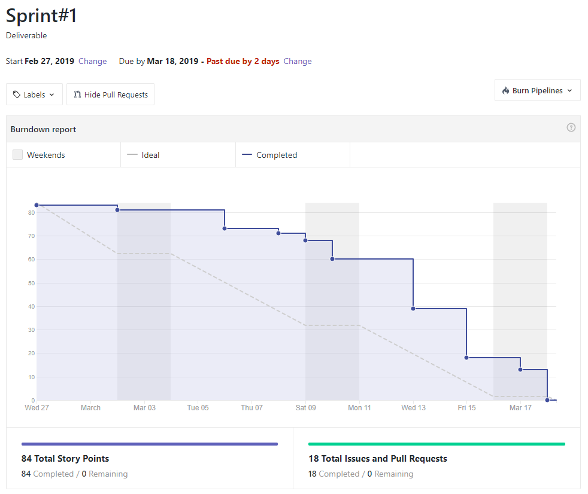
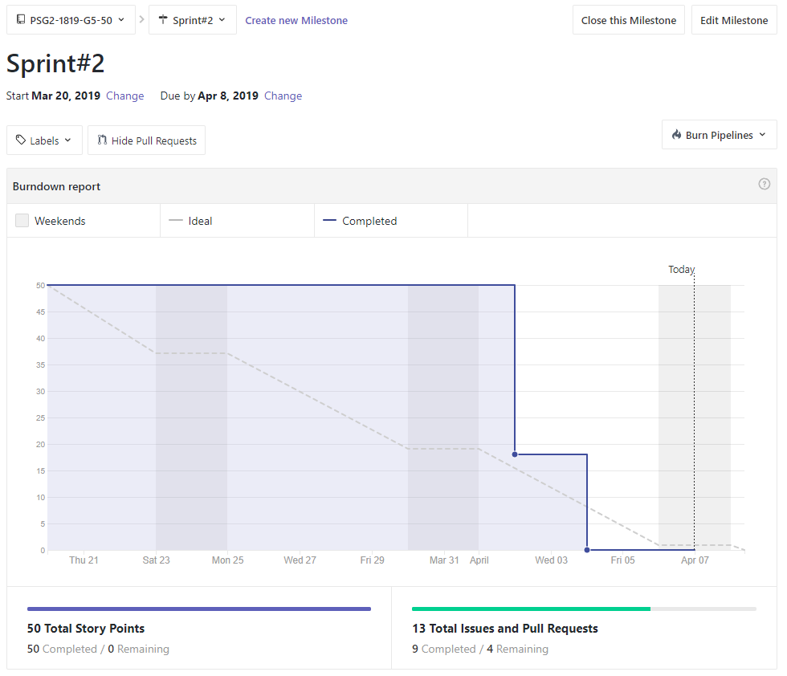
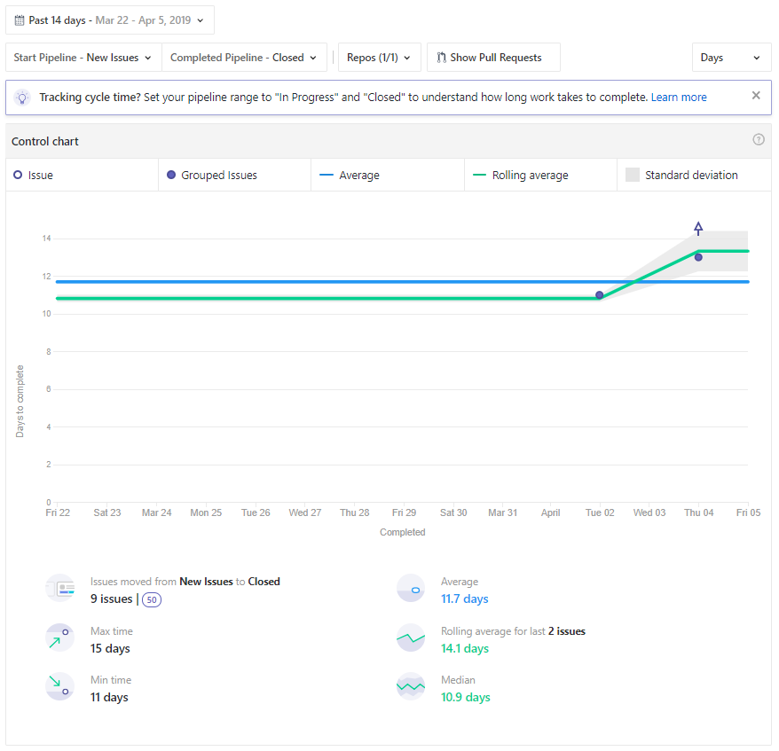

# Universidad de Sevilla
## Escuela Técnica Superior de Ingeniería Informática
&nbsp;
&nbsp;
# L3 - Measurement

## Grado en Ingeniería Informática - Ingeniería del Software

## Proceso de Software y Gestión 2
## Curso 2018 - 2019

| Fecha     |    |Revisión |
|-----------|----|----------|
|07/04/2019 |    |v01e00|

Grupo de Prácticas: G5-50

| Autores |     | Rol |
|---------|-----|------|
| González Valiñas, Pedro Agustín |  | Scrum Master |
| Delgado Luna, Ángel             |  | Team member |
| Novoa Montero, Ana María        |  | Team member |
| Pérez Capitán, Sergio           |  | Team member |
| Rosado Bornes, Víctor           |  | Team member |
| Sánchez Hipona, Antonio         |  | Team member |

&nbsp;
# Métricas de Proceso Ágil y Recursos

| Índice |
|--------|
| [1. Sprint L2](#sprint-l2) |
| [2. Sprint L3](#sprint-l3) |

## Sprint L2

### Burndown chart

La captura de pantalla incluye el número total de historias entregadas que es 84 y el porcentaje es un 100%.

             

## Sprint L3

### Burndown chart

La captura de pantalla incluye el número total de historias entregadas que es 50 y el porcentaje es un 100%.

Actualmente en la redacción de este documento, existen 4 issues de documentación abiertas que no tienen puntos de historia asociados. Las issues de código están completadas.

             

### Control chart - Lead Time

A continuación de muestra el gráfico del Lead Time.

               

### Control chart - Cycle Time

A continuación de muestra el gráfico del Cycle Time.

               

### NikoNiko calendar

| Day           | Date | [Ana](https://github.com/ananovmon)    | [Capi](https://github.com/Capi9888)     | [Ángel](https://github.com/angel96)     | [Víctor](https://github.com/SiiNerGia)     | [Antonio](https://github.com/antonihipona)     | [Pedro](https://github.com/pedroswe)     |
| ------------- | ------------- | -------------  | -------------  | -------------  | -------------  | -------------  | -------------  |
| Day 1         |  20/03/2019   |       -        |        -       |        -       |       -        |       -        |       -        |
| Day 2         |  21/03/2019   |       -        |        -       |        -       |       -        |       -        |       -        |
| Day 3         |  22/03/2019   |       -        |        -       |        -       |       -        |       -        |       -        |
| Day 4         |  23/03/2019   |       -        |        -       |        -       |       -        |       -        |       -        |
| Day 5         |  24/03/2019   |       -        |        -       |        -       |       -        |       -        |       -        |
| Day 6         |  25/03/2019   |       -        |        -       |        -       |       -        |       -        |       -        |
| Day 7         |  26/03/2019   |       -        |        -       |        -       |       -        |       -        |       -        |
| Day 8         |  27/03/2019   |    :smiley:    |        -       |        -       |       -        |:neutral_face:  |    :smiley:    |
| Day 9         |  28/03/2019   |       -        |        -       |        -       |       -        |       -        |       -        |
| Day 9         |  29/03/2019   |       -        |        -       |        -       |       -        |       -        |       -        |
| Day 10        |  30/03/2019   |  :smiley:      |        -       |        -       |       -        |       -        |       -        |
| Day 11        |  31/03/2019   |       -        |        -       |        -       |       -        |       -        |       -        |
| Day 12        |  01/04/2019   |       -        |  :smiley:      |        -       |       -        |       -        |       -        |
| Day 13        |  02/04/2019   |       -        |        -       |:full_moon_with_face:     |       -        |       -        |       -        |
| Day 14        |  03/04/2019   |   :smiley:     |   :smiley:     |        -       |    :worried:   |:neutral_face:  |:neutral_face:  |
| Day 15        |  04/04/2019   |       -        |        -       |:full_moon_with_face:     |       -        |:neutral_face:  |:neutral_face:  |
| Day 16        |  05/04/2019   |   :smiley:     |        -       |:full_moon_with_face:     |       -        |:neutral_face:  |:neutral_face:  |
| Day 17        |  06/04/2019   |       -        | :smiley:       |        -       |       -        |       -  | -  |
| Day 18        |  07/04/2019   |       -        |        -       |        -       |       -        |       :neutral_face:        |       :neutral_face:       |
| Day 19        |  08/04/2019   |       -        |        -       |        -       |       -        |       -        |        -       |

Basándonos en el resultado del calendario nikoniko se aprecia que ha habido un gran periodo de inactividad para el desarrollo de las tareas de este entregable, seguramente debido a la existencia de entregables de otras asignaturas que coinciden en el marco temporal. 

Sobre los emoticonos empleados, predominan caritas neutras, debido a que las tareas requieren conocimientos de Spring que para los compañeros que cursan Diseño y Pruebas no requieren de mayor esfuerzo, sólo tiempo para su realización.

Es interesante que aquellos compañeros que no cursan Diseño y Pruebas, tienen caritas sonrientes, lo cual se corresponde con la motivación que han manifestado en las tareas de código asignadas en este entregable.

La carita de preocupación registrada evidencia la necesidad comentada en los Sprint Review y Retrospective para acabar las tareas de código.