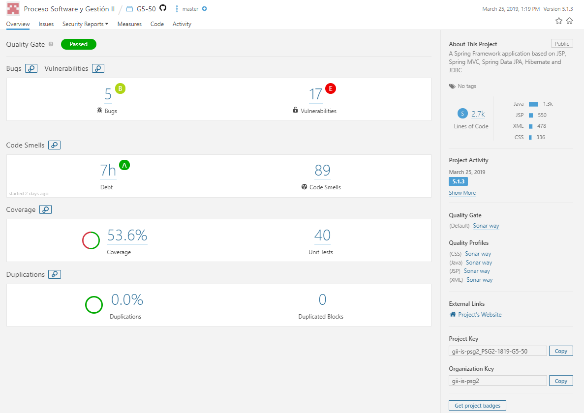
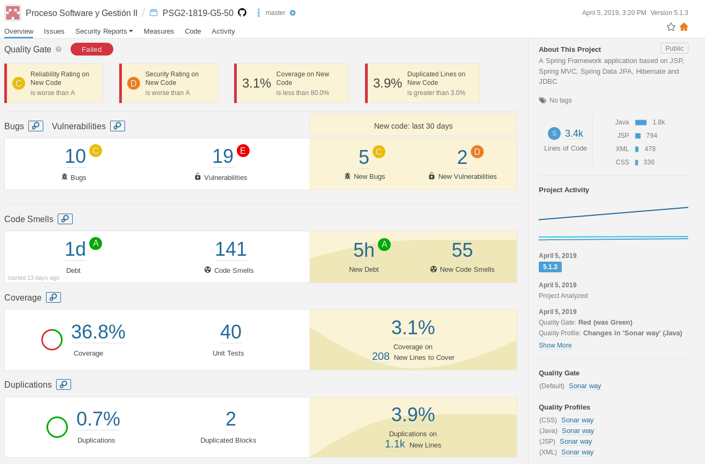

# Universidad de Sevilla
## Escuela Técnica Superior de Ingeniería Informática
&nbsp;
&nbsp;
# L3 - Measurement


## Grado en Ingeniería Informática - Ingeniería del Software

## Proceso de Software y Gestión 2
## Curso 2018 - 2019

| Fecha     |    |Revisión |
|-----------|----|----------|
|07/04/2019 |    |v01e00|
|07/04/2019 |    |v01e01|
|07/04/2019 |    |v01e02|

Grupo de Prácticas: G5-50

| Autores |     | Rol |
|---------|-----|------|
| González Valiñas, Pedro Agustín |  | Scrum Master |
| Delgado Luna, Ángel             |  | Team member |
| Novoa Montero, Ana María        |  | Team member |
| Pérez Capitán, Sergio           |  | Team member |
| Rosado Bornes, Víctor           |  | Team member |
| Sánchez Hipona, Antonio         |  | Team member |

&nbsp;
# Análisis del Código Fuente y Métricas Asociadas

| Índice |
|--------|
| [1. Métricas del dashboard de Sonar Cloud](#1-métricas-del-dashboard-de-sonar-cloud) |
| [2. Bugs y malos olores](#2-bugs-y-malos-olores) |
| [3. Conclusiones](#3-conclusiones) |

# 1. Métricas del dashboard de Sonar Cloud

En el dashboard aparecen una serie de métricas que nos ayudan a entender el estado de la calidad del código del proyecto.
 - __Bugs:__ Cantidad de bugs. Un bug código que puede llegar a generar un fallo de funcionamiento de la aplicación.
 - __Vulnerabilities:__ Cantidad de vulnerabilidades. Una vulnerabilidad es código que puede generar un fallo de seguridad en la aplicación.
 - __Debt:__ Estimación de la cantidad de tiempo necesario para arreglar los malos olores.
 - __Code Smells:__ Cantidad de malos olores encontrados. Los malos olores son sentencias de código que dificultan la legibilidad y mantenibilidad del mismo.
 - __Coverage:__ Porcentaje de sentencias de código cubiertas
 - __Unit Tests:__ Cantidad de tests unitarios
 - __Duplications:__ Porcentaje de código duplicado.
 - __Duplicated Blocks:__ Cantidad de bloques de código que han sido duplicados.

## Sprint 1



<br><br>

## Sprint 2




# 2. Bugs y malos olores

Los bugs potenciales y malos olores que se describen a continuación están agrupados por el tipo de error y ordenados por la gravedad de los mismos.

>__NOTA__: Solo se muestran los bugs potenciales y malos olores introducidos en cada sprint.

## L2 (27/02/2019 - 18/03/2019)

### __Bugs potenciales__

No se han introducido bugs potenciales en este sprint.

### __Malos olores__
Gravedad | Cantidad | Tipo de olor | Descripción | Solución
---------|----------|---------------|-------------|---------
<span style="color:red">Crítico</span> | 3 | Strings literals should not be duplicated | Es debido a que en varias clases se usan literales idénticos | Crear una constante global que contenga el literal repetido y usarla en su lugar
<span style="color:orange">Mayor</span> | 4 | Sections of code should not be commented out | Es debido a que hay código comentado | Eliminar los bloques de código comentados
<span style="color:orange">Mayor</span> | 1 | Nested blocks of code should not be left empty | Es debido a que hay sentencias de control que no contienen operaciones en algunas de sus ramas <br>__Ejemplo:__ ```for (int i = 0; i < 42; i++){}``` | Eliminar las ramas de las sentencias de control que son innecesarias o refactorizar el código para que aumentar la legibilidad
<span style="color:green">Menor</span> | 19 | "Throws declarations should not be superfluous" | Es debido a que varios métodos del proyecto tienen al final la declaración ```throws DataAccessException``` | Eliminar esta declaración
<span style="color:green">Menor</span> | 12 | Composed ```"@RequestMapping"``` variants should be preferred | Es debido a que desde la versión 4.3 del framework de Spring se han introducido variantes de este tipo de anotaciones para representarlas mejor semánticamente | Sustituir ```@RequestMapping(method = RequestMethod.GET)``` por ```@GetMapping``` y ```@RequestMapping(method = RequestMethod.POST)``` por ```@PostMapping```
<span style="color:green">Menor</span> | 2 | Unnecessary imports should be removed | Es debido a que importaciones innecesarias en varias clases | Eliminar estas importaciones innecesarias
<span style="color:green">Menor</span> | 1 | Redundant casts should not be used | Es debido a que se hace un casting de forma innecesaria | Eliminar el casting para que el código sea más fácil de entender


## L3 (20/03/2019 - 08/04/2019)

### __Bugs potenciales__
Gravedad | Cantidad | Tipo de bug | Descripción | Solución
---------|----------|---------------|-------------|---------
<span style="color:orange">Mayor</span> | 3 | Strings and Boxed types should be compared using "equals()" | Es debido a que se compara un objeto no primitivo (incluido String) usando ```==``` en lugar de ```.equals()``` | Sustituir ```o1 == o2``` por ```o1.equals(o2)```
<span style="color:orange">Mayor</span> | 1 | All branches in a conditional structure should not have exactly the same implementation | Es debido a que se utiliza una sentencia de control y se realiza la misma operación en todas las ramas<br>__Ejemplo:__ ```if (b == 0) { doOneMoreThing(); } else { doOneMoreThing(); }``` | Eliminar la sentencia de control puesto que es innecesaria
<span style="color:orange">Mayor</span> | 1 | Map values should not be replaced unconditionally | Es debido a que se está insertando un valor y su clave en un mapa y luego se está sobreescribiendo de forma no condicional | Eliminar las inserciones innecesarias en el Map ya que solo se utiliza la última, que es la que sobreescribe el valor

### __Malos olores__
Gravedad | Cantidad | Tipo de olor | Descripción | Solución
---------|----------|---------------|-------------|---------
<span style="color:red">Crítico</span>  | 3 | Strings literals should not be duplicated | Es debido a que en varias clases se usan literales idénticos | Crear una constante global que contenga el literal repetido y usarla en su lugar
<span style="color:orange">Mayor</span> | 2 | Dead stores should be removed | Es debido a la asignación de un valor a una variable local y nunca es leído en una instrucción posterior | Eliminar esta asignación innecesaria 
<span style="color:orange">Mayor</span> | 2 | Sections of code should not be commented out | Es debido a que hay código comentado | Eliminar los bloques de código comentados
<span style="color:orange">Mayor</span> | 2 | Throwable and Error should not be caught | Es debido a que ```Throwable``` y ```Error``` son superclases que no se deben capturar en los bloques ```try/catch``` | Capturar ```Exception``` en su lugar
<span style="color:orange">Mayor</span> | 1 | Source files should not have any duplicated blocks | Es debido a la existencia de bloques de código duplicados en un archivo | Hacer un método que contenga las instrucciones del bloque de código que se repite y usarlo en su lugar
<span style="color:green">Menor</span> | 31 | "Throws declarations should not be superfluous" | Es debido a que varios métodos del proyecto tienen al final la declaración ```throws DataAccessException``` | Eliminar esta declaración
<span style="color:green">Menor</span> | 8 | Composed ```"@RequestMapping"``` variants should be preferred | Es debido a que desde la versión 4.3 del framework de Spring se han introducido variantes de este tipo de anotaciones para representarlas mejor semánticamente | Sustituir ```@RequestMapping(method = RequestMethod.GET)``` por ```@GetMapping``` y ```@RequestMapping(method = RequestMethod.POST)``` por ```@PostMapping```
<span style="color:green">Menor</span> | 4 | The diamond operator ("<>") should be used | Es debido a que desde Java 7 no es necesario declarar en el constructor el tipo entre ```<>``` ya que el compilador lo asignará automáticamente <br> __Ejemplo:__ ```List<String> strings = new ArrayList<String>();``` | Eliminar la declaración del tipo en el constructor<br>__Ejemplo:__```List<String> strings = new ArrayList<>();```
<span style="color:green">Menor</span> | 2 | Unnecessary imports should be removed | Es debido a que importaciones innecesarias en varias clases | Eliminar estas importaciones innecesarias

# 3. Conclusiones

La mayoría de bugs y malos olores que se han introducido en la aplicación pueden deberse a que no se ha realizado refactorización de código, y son fáciles de corregir.

Tiene sentido que el porcentaje de sentencias de código que cubren los tests sea menor, ya que no se han añadido más.
