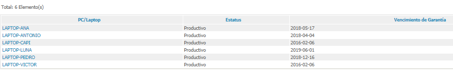

# Universidad de Sevilla
## Escuela Técnica Superior de Ingeniería Informática
&nbsp;
&nbsp;
# L4 - Measurement  ITIL

## Grado en Ingeniería Informática - Ingeniería del Software

## Proceso de Software y Gestión 2
## Curso 2018 - 2019

| Fecha     |    |Revisión |
|-----------|----|----------|
|15/05/2019 |    |v01e00|

Grupo de Prácticas: G5-50

| Autores |     | Rol |
|---------|-----|------|
| González Valiñas, Pedro Agustín |  | Scrum Master |
| Delgado Luna, Ángel             |  | Team member |
| Novoa Montero, Ana María        |  | Team member |
| Pérez Capitán, Sergio           |  | Team member |
| Rosado Bornes, Víctor           |  | Team member |
| Sánchez Hipona, Antonio         |  | Team member |

&nbsp;
# Bases de Datos de Gestión de la Configuración en el contexto de ITIL

| Índice |
|--------|
| [1. Objetives and scope of the CMDB](#1-objetives-and-scope-of-the-cmdb) |
| [2. Description of the service provided and justification of the need for a CMDB.](#2-description-of-the-service-provided-and-justification-of-the-need-for-a-cmdb) |
| [3. Structure of the CMDB, including some examples of the identified Configurable Items.](#3-structure-of-the-cmdb-including-some-examples-of-the-identified-configurable-items) |
| [4. Listing of the contents of the Definitive Software Library (DSL), including the estimated cost of the sofware contained in the DSL.](#4-listing-of-the-contents-of-the-definitive-software-library-dsl-including-the-estimated-cost-of-the-sofware-contained-in-the-dsl) |
| [5. An export of the CMDB.](#5-an-export-of-the-cmdb) |
| [6. Report with the solutions provided to the service requests.](#6-report-with-the-solutions-provided-to-the-service-requests) |

## 1. Objetives and scope of the CMDB

Los objetivos principales de las bases de datos de gestión de la configuración (CMDB) son los siguientes:

- Almacenar la configuracion y las operaciones de tecnologías de información (IT) sobre servicios y organizaciones.
- Da soporte a procesos dentro de la organización.
- Provee información para manejar incidente, despliegues, riesgos, cambios y auditorías

El alcance principal de la CMDB es dar respuesta a una serie de cuestiones técnicas, lógicas y operativas relacionadas con la organización y los servicios. Para ello cuenta con herramientas como el enlace de ciertos objetos de configuración y búsquedas de los mismos.

## 2. Description of the service provided and justification of the need for a CMDB

iTop, que es un CMDB (Base de datos de gestión de la configuración), es un software que nos permite mantener un registro de cada uno de los elementos de configuración de una empresa y la relación entre ellos, permitiendo tener así una vista clara de las posibilidades y configuración de los equipos de una empresa y otras funcionalidades adicionales. Algunas de las funcionalidades del software iTop son la gestión de incidentes, gestión de problemas, exportación e importación a CSV y Excel, análisis grafico de impacto, notificaciones configurables, etc.

Los softwares de CMDB son importantes y necesarios en una empresa ya que a medida que va creciendo la empresa se hace más difícil llevar un registro de cosas como las especificaciones de hardware de cada equipo dentro de la empresa, el software que tiene instalado cada equipo, si alguno de esos equipos tiene alguna clase de problema, si está disponible para asignárselo a algún trabajador o ya esta en uso, etc. Llevar este tipo de registro es especialmente importante si el tamaño de la empresa es bastante grande. Además, también permite hacer un análisis de impacto, y saber si nuestra empresa cuenta con los recursos informáticos necesarios para poder realizar ciertas tareas. Por ejemplo, a una empresa le piden diseñar un cartel publicitario. ¿Dispone esa empresa de algún ordenador con Photohsop? ¿En que ordenadores? ¿Quién los tiene? ¿Hasta cuando dura la licencia? ¿Las pantallas del PC que tiene Photosop son suficientemente buenas? Todo esto podemos verlo fácilmente mediante el uso de un CMDB.

  

## 3. Structure of the CMDB, including some examples of the identified Configurable Items

La CMDB de nuestra organización está compuesta por una serie de Elementos de Configuración(EC) de tipo físico, que hace referencia a los componentes electrónicos que forman parte del entorno de trabajo, herramientas tecnológicas que ayudan a la correcta prestación de un servicio requerido: 
- PCs con información referente al Sistema Operativo, CPU, RAM, marca y modelo, etc
- Periféricos en los que se incluyen: GPU, monitores, con su respectiva información

También cuenta con EC de tipo lógico, es decir, la instalación software de nuestro equipo de trabajo, concretando para cada miembro del equipo, los programas computacionales con los que desarrollamos y satisfacemos las demandas del cliente, a los que están estrechamente relacionado los EC conceptuales, como son las licencias contratadas por nuestra organización para el uso de dichos programas y las garantías que se nos ofrecen por contratar dichos servicios. 
EC lógicos:
- Servidores Web/Servidor de Base de Datos: Tomcat, Jetty, Oracle, MySQL...
- Software de PC: VSCODE, Office 365, Git, Eclipse, etc
- Máquina virtual

 

## 4. Listing of the contents of the Definitive Software Library (DSL), including the estimated cost of the sofware contained in the DSL

### Contenido:

### Estimated cost:
We are students and we chose the software in de DSL because we have free access to it, so costs are 0.

     

## 5. An export of the CMDB
Hemos exportado la CMDB y la hemos adjuntado al repositorio. Puede descargarse desde [nuestro repositorio](https://github.com/gii-is-psg2/PSG2-1819-G5-50/blob/master/docs/EC_Funcional_Export.csv).

Aunque intentaremos añadirlo como adjunto al PDF.

 

## 6. Report with the solutions provided to the service requests

 

### Pregunta 1.
1. Se desea prestar un servicio a una empresa X, la cual funciona con la norma ISO 6969, que establece que todos los equipos hardware deben tener una garantía mínima de dos años.

NO podemos atender a la empresa porque ninguno de nuestros pcs cumple con el requerimiento.

 

### Pregunta 2.
2. Se desea prestar un servicio de gestión de imágenes por satélite, para ello es necesario instalar un software bajo Windows que funcione en resoluciones de pantallas superiores a 1920 x 1080.

Sí, Pedro y Capi tienen pantallas de 4K.

      

### Pregunta 3.

3. Se recibe un correo de un distribuidor autorizado indicando que deben actualizar TODAS las instalaciones de sistemas operativos Windows a Windows 10.1. La tabla de precio de las actualizaciones es la siguiente:

|Versión anterior | Coste de actualización |
|-----------------|------------------------|
| Windows XP | 80€ |
| Windows Vista | 60€ |
| Windows 7 | 20€ |
| Windows 8 | 5€ |
| Windows 10 | 0€ |

Cuantifique económicamente (y justifique) el coste de esta actualización para su grupo. Considere que el único requisito que tiene Windows 10.1 para su instalación es contar con, al menos 8 GB de memoria RAM.

Como podemos ver, el coste sería de 0€ porque todos tenemos Windows 10.

### Pregunta 4.

4. Evalúe qué impacto tendría en su organización si el ordenador del miembro de grupo sentado más a la izquierda explotara y no se pudiera recuperar nada del disco duro.
¿Cómo afectaría eso a la respuesta de las peticiones anteriores?

Respecto al software, tenemos laptops con SW similar.
Respecto al hardware, tenemos otros laptops de similares características.
A la primera petición, idéntico resultado.
A la segunda petición, tenemos otro pc disponible para prestar el servicio y la pantalla no se ha visto afectada.
A la tercera petición, no afectaría.

### Pregunta 5.

5. Su grupo ha decidido utilizar el software Sonar-Qube con los siguientes requisitos:

- Java JDK 1.8
- Microsoft SQL Express Edition 2005 0 2008
- Apache Tomcat 7.X
- Google Chrome (cualquier versión)

Indique los cambios a realizar en su DSL.

Incluir el software necesaario.

### Pregunta 6.

6. Se plantea la inclusión en la DSL de la organización de la herramienta Microsoft Teams como única herramienta para comunicación corporativa. Evalúe el impacto de esto en la DSL actual y en los equipos registrados en la CMDB. Se recomienda consultar el soporte de la herramienta para los distintos Sistemas Operativos.

Añadir Microsoft Teams a la DSL, consultar la disponibilidad y evaluarla en el contexto que tenemos en nuestra organización.

Quitamos Gitter.
Meter Microsoft Teams en todos los sistemas, sin problemas de compatibilidad porque todos los pcs tienen Windows 10.

A continuación de muestra el gráfico del Cycle Time.

