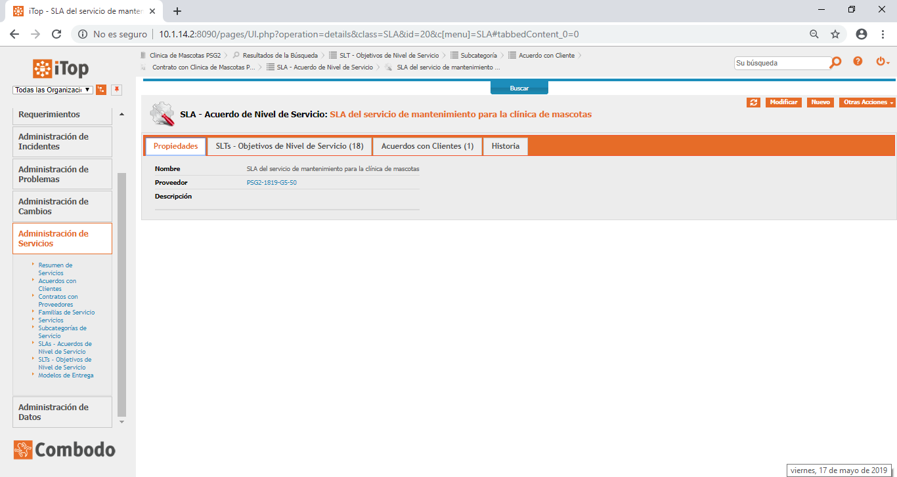
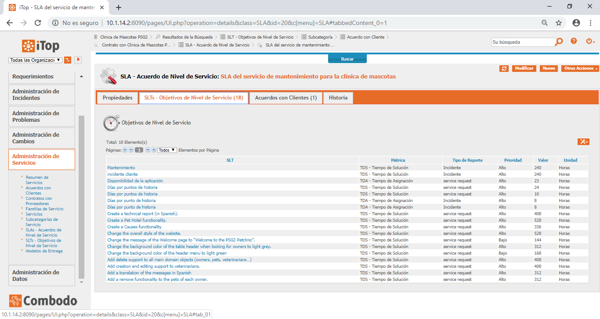
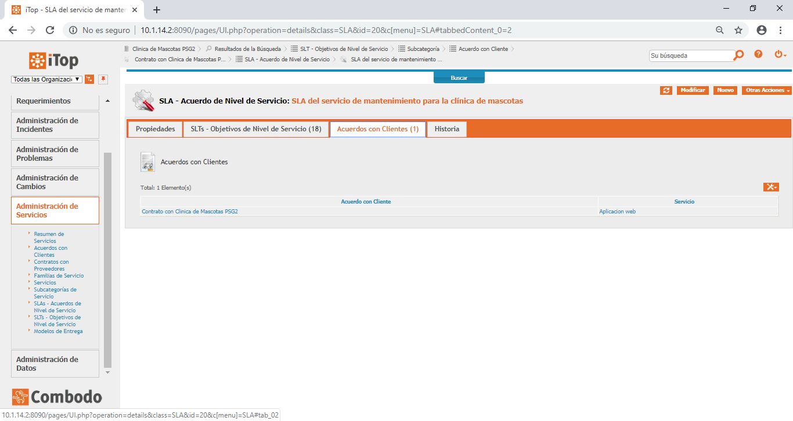
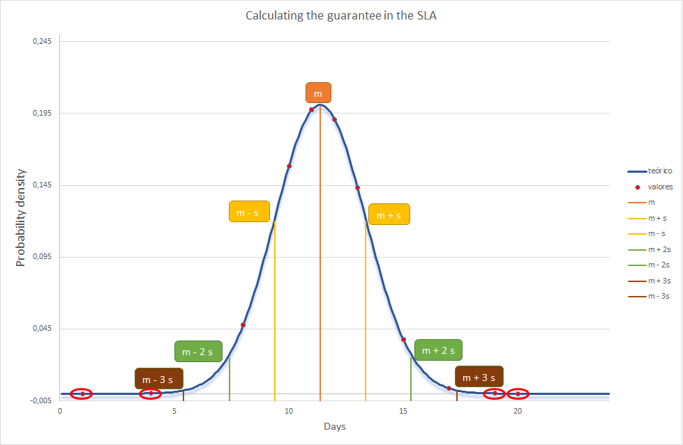
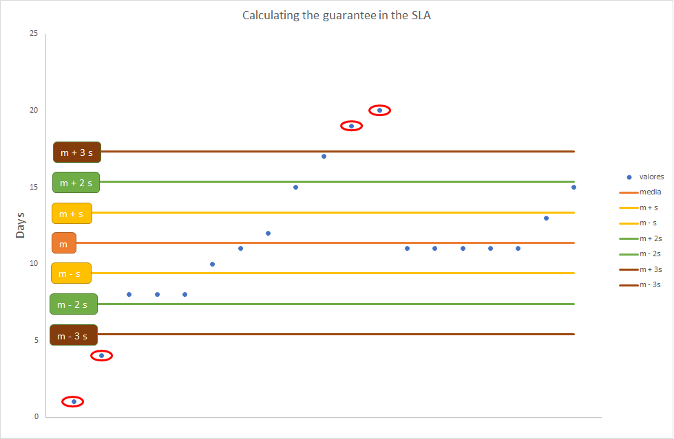

# Universidad de Sevilla
## Escuela Técnica Superior de Ingeniería Informática
&nbsp;
&nbsp;
# L4 - ITIL

## Grado en Ingeniería Informática - Ingeniería del Software

## Proceso de Software y Gestión 2
## Curso 2018 - 2019

| Fecha     |    |Revisión |
|-----------|----|----------|
|19/05/2019 |    |v01e00|
|20/05/2019 |    |v01e01|

Grupo de Prácticas: G5-50

| Autores |     | Rol |
|---------|-----|------|
| González Valiñas, Pedro Agustín |  | Scrum Master |
| Delgado Luna, Ángel             |  | Team member |
| Novoa Montero, Ana María        |  | Team member |
| Pérez Capitán, Sergio           |  | Team member |
| Rosado Bornes, Víctor           |  | Team member |
| Sánchez Hipona, Antonio         |  | Team member |

# SLA del servicio de mantenimiento para la clínica de mascotas

| Índice |
|--------|
| [1. A screenshot of the SLA generated in iTop, and its association to the maintenance service as created in the iTop tool.](#1-a-screenshot-of-the-sla-generated-in-itop-and-its-association-to-the-maintenance-service-as-created-in-the-itop-tool) |
| [2. The definition of the SLA document.](#2-the-definition-of-the-sla-document) |
| [3. A justification and rationale of the value provided for the guarantee in the SLA.](#3-a-justification-and-rationale-of-the-value-provided-for-the-guarantee-in-the-sla) |

## 1. A screenshot of the SLA generated in iTop, and its association to the maintenance service as created in the iTop tool

A continuación se muestran las capturas solicitadas.

## 2. The definition of the SLA document

Un documento SLA es aquel que describe las garantías del servicio que una empresa se compromete a prestar a un cliente.

## 3. A justification and rationale of the value provided for the guarantee in the SLA

Teniendo en cuenta los sprints anteriores, hemos obtenido la siguiente tabla en la que se muestran las issues y sus respectivos valores sobre el tiempo en días y el valor de sus puntos de historia.

| Completed Issues | Issue started | Issue Closed | Time in days | Estimate history points |
| -----------------| --------------| -------------| -------------| ------------------------|
|A2.2.2 (5%) - Clone repo and initPSG2-1819-G5-50 #1	| Feb 26	| Feb 27	| 1	| 1 |
|A2.2.3.e - Translate messages to SpanishPSG2-1819-G5-50 #6 |	Feb 26	| Mar 2	| 4	| 2 |
|A2.2.3.d - Owner DELETE his petsPSG2-1819-G5-50 #5	| Feb 26	| Mar 6	| 8	| 3 |
|A2.2.3.c - Change welcomePage messagePSG2-1819-G5-50 #4	| Feb 26	| Mar 6	|8	| 2 |
|A2.2.3.a - Change header colorPSG2-1819-G5-50 #2 |	Feb 26 |	Mar 6 |	8 |	3 |
|A2.2.3.b - Change background colorPSG2-1819-G5-50 #3	| Feb 26	| Mar 8	| 10	| 2 |
|A2.2.3.f - Change background color when looking for OwnersPSG2-1819-G5-50 #7	| Feb 26	| Mar 9	| 11	| 3 |
|A2.3.3.d - Owner, Pet, Veterinarian DELETEPSG2-1819-G5-50 #16	| Feb 26	| Mar 10	| 12	| 8 |
|A.2.3.3.c - Veterian CREATE and EDIT functionallityPSG2-1819-G5-50 #15	| Feb 26	| Mar 13	| 15	| 21 |
|A2.3.3.a - Create PetHotelPSG2-1819-G5-50 #13	| Feb 26	| Mar 15	| 17	| 21 |
|A.2.3.3.b - Reassign logos, fonts & colors of the pagesPSG2-1819-G5-50 #14	| Feb 26	| Mar 17	| 19	| 5 |
|A.2.3.4 - Prepare a release of the Petclinic projectPSG2-1819-G5-50 #17 |	Feb 26 |	Mar 18 | 20	| 13 |
|CAUSE - Domain modelPSG2-1819-G5-50 #21	| Mar 22	| Apr 2	| 11	| 3 |
|CAUSE - repo and servicePSG2-1819-G5-50 #22	| Mar 22	| Apr 2	| 11	| 5 |
|DONATION - Domain modelPSG2-1819-G5-50 #25	| Mar 22	| Apr 2	| 11	| 3 |
|DONATION - repo and servicePSG2-1819-G5-50 #26	| Mar 22	|Apr 2	| 11 |	8 |
|CAUSE - views and controllerPSG2-1819-G5-50 #23 |	Mar 22 |	Apr 2 |	11 |	13 |
|DONATION - views and controllerPSG2-1819-G5-50 #27	| Mar 22	| Apr 4	| 13	| 13 |
|Validate Booking CreationPSG2-1819-G5-50 #19	| Mar 20	| Apr 4 | 	15	| 5 |

